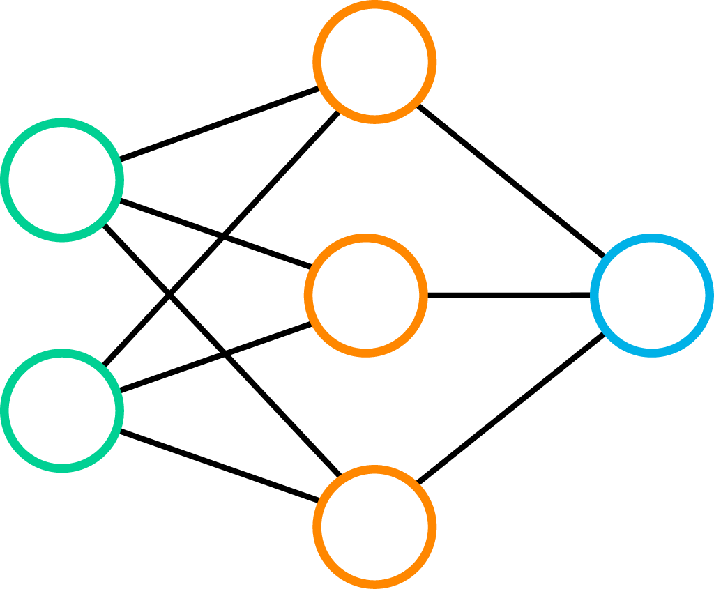
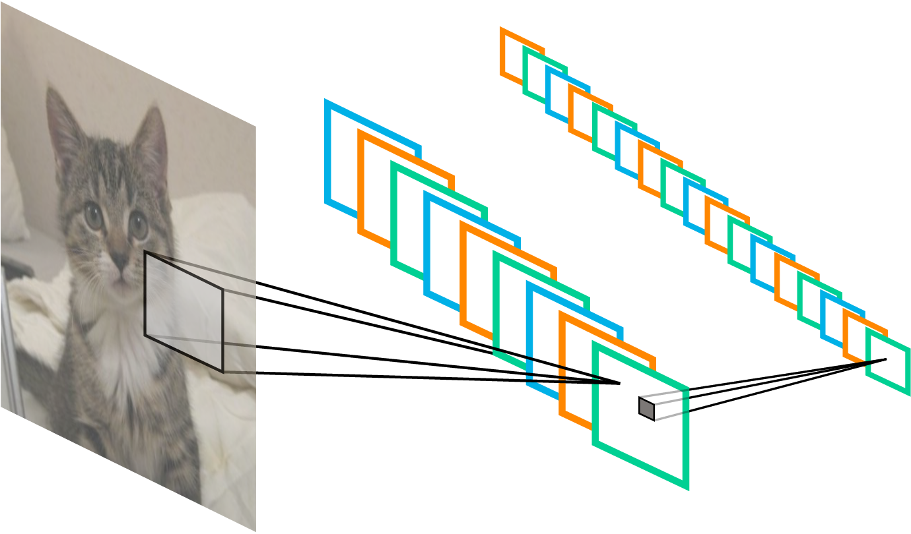
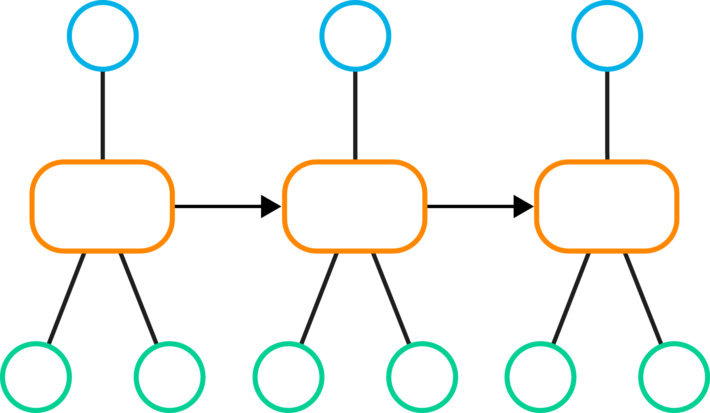

# Machine Learning in TensorFlow

The purpose of this repo is to offer anyone who wants to get started with using [TensorFlow](https://www.tensorflow.org) a number of examples to get a kickstart with. They aren't necessarily optimized on solving the problem, since that isn't the purpose, but rather serve as a starting ground to play around with for your own experiments and optimizations!

It is currently under construction, but if you have any feedback or comments, I'd gladly hear them!

## Neural Networks

  

### Good Reads
* [Neural Networks (part of CS231 at Stanford)](http://cs231n.github.io/neural-networks-1/) - ([Part 1](http://cs231n.github.io/neural-networks-1/), [Part 2](http://cs231n.github.io/neural-networks-2/), [Part 3](http://cs231n.github.io/neural-networks-3/))
* [Neural Networks and Deep Learning](http://neuralnetworksanddeeplearning.com/index.html)

### Implemented Examples
* [XOR](/experiments/xor)
* [MNIST](/experiments/mnist)

## Convolutional Neural Networks

  

### Good Reads
* [Convolutional Neural Networks (part of CS231 at Stanford)](http://cs231n.github.io/convolutional-networks/)

### Implemented Examples
* [Deep MNIST](/experiments/deep-mnist)

## Recurrent Neural Networks

  

### Good reads
* [The Unreasonable Effectiveness on Recurrent Neural Networks](http://karpathy.github.io/2015/05/21/rnn-effectiveness/)
* [Understanding LSTM Networks](http://colah.github.io/posts/2015-08-Understanding-LSTMs/)

### Implemented Examples

## Reinforcement Learning (with Neural Networks)

### Good reads
* [Deep Reinforcement Learning: Pong from pixels](http://karpathy.github.io/2016/05/31/rl/)
* [Dissecting Reinforcement Learning](https://mpatacchiola.github.io/blog/2016/12/09/dissecting-reinforcement-learning.html)
* [Demystifying Deep Reinforcement Learning](https://www.nervanasys.com/demystifying-deep-reinforcement-learning/) - ([Part 1](https://www.nervanasys.com/demystifying-deep-reinforcement-learning/), [Part 2](https://www.nervanasys.com/deep-reinforcement-learning-with-neon/), [Part 3](https://www.nervanasys.com/openai/))
* [Asynchronous Deep Reinforcement Learning from pixels](https://dbobrenko.github.io/2016/11/03/async-deeprl.html)

### Implemented Examples
* [Q-Gridworld](/experiments/q-gridworld)
* [NN-Gridworld](/experiments/nn-gridworld)
