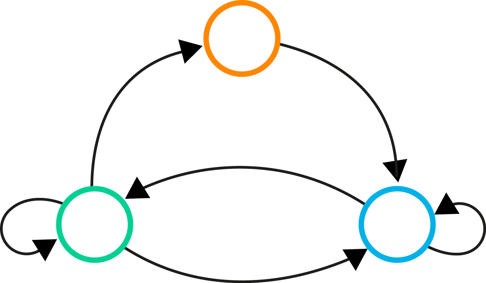

# Machine Learning in TensorFlow

The purpose of this repository is to offer anyone who wants to get started with using [TensorFlow](https://www.tensorflow.org) a number of experiments, where the same problem is solved through different techniques, showcasing different methods of approaching the same problem. 

The implementations and parameters aren't necessarily optimized to solve the problem, since that isn't the purpose, but rather serve as a solid starting ground to play around with for your own experiments and optimizations!

It is currently under construction, but if you have any feedback, suggestions or comments - I'd gladly hear it!

## Reinforcement Learning

  

### Implemented Examples
* [Q-Gridworld](/experiments/q-gridworld) 
* [Classic Control with Policy Gradient](/experiments/pg-classic_control) (_Work in progress_)
* [Deep Q-Learning in Atari](/experiments/dqn) (_Work in progress_)

### Good reads
* [Deep Reinforcement Learning: Pong from pixels](http://karpathy.github.io/2016/05/31/rl/)
* [Dissecting Reinforcement Learning](https://mpatacchiola.github.io/blog/2016/12/09/dissecting-reinforcement-learning.html) - ([Part 1](https://mpatacchiola.github.io/blog/2016/12/09/dissecting-reinforcement-learning.html), [Part 2](https://mpatacchiola.github.io/blog/2017/01/15/dissecting-reinforcement-learning-2.html), [Part 3](https://mpatacchiola.github.io/blog/2017/01/29/dissecting-reinforcement-learning-3.html))
* [Demystifying Deep Reinforcement Learning](https://www.nervanasys.com/demystifying-deep-reinforcement-learning/) - ([Part 1](https://www.nervanasys.com/demystifying-deep-reinforcement-learning/), [Part 2](https://www.nervanasys.com/deep-reinforcement-learning-with-neon/), [Part 3](https://www.nervanasys.com/openai/))
* [Asynchronous Deep Reinforcement Learning from pixels](https://dbobrenko.github.io/2016/11/03/async-deeprl.html)

## Neural Networks

  

### Implemented Examples
* [XOR](/experiments/xor) (_Work in progress_)
* [NN-MNIST](/experiments/nn-mnist) 
* [NN-Gridworld](/experiments/nn-gridworld)

### Good Reads
* [Machine Learning Crash Course](https://ml.berkeley.edu/blog/2016/11/06/tutorial-1/) - ([Part 1](https://ml.berkeley.edu/blog/2016/11/06/tutorial-1/), [Part 2](https://ml.berkeley.edu/blog/2016/12/24/tutorial-2/))
* [Neural Networks (part of CS231 at Stanford)](http://cs231n.github.io/neural-networks-1/) - ([Part 1](http://cs231n.github.io/neural-networks-1/), [Part 2](http://cs231n.github.io/neural-networks-2/), [Part 3](http://cs231n.github.io/neural-networks-3/))
* [Neural Networks and Deep Learning](http://neuralnetworksanddeeplearning.com/index.html)

## Recurrent Neural Networks

  

### Implemented Examples
* [RNN-MNIST](/experiments/rnn-mnist) 

### Good reads
* [The Unreasonable Effectiveness on Recurrent Neural Networks](http://karpathy.github.io/2015/05/21/rnn-effectiveness/)
* [Understanding LSTM Networks](http://colah.github.io/posts/2015-08-Understanding-LSTMs/)

## Convolutional Neural Networks

  

### Implemented Examples
* [CNN-MNIST](/experiments/cnn-mnist)

### Good Reads
* [Convolutional Neural Networks (part of CS231 at Stanford)](http://cs231n.github.io/convolutional-networks/)
* [How do Convolutional Neural Networks work?](http://brohrer.github.io/how_convolutional_neural_networks_work.html)

