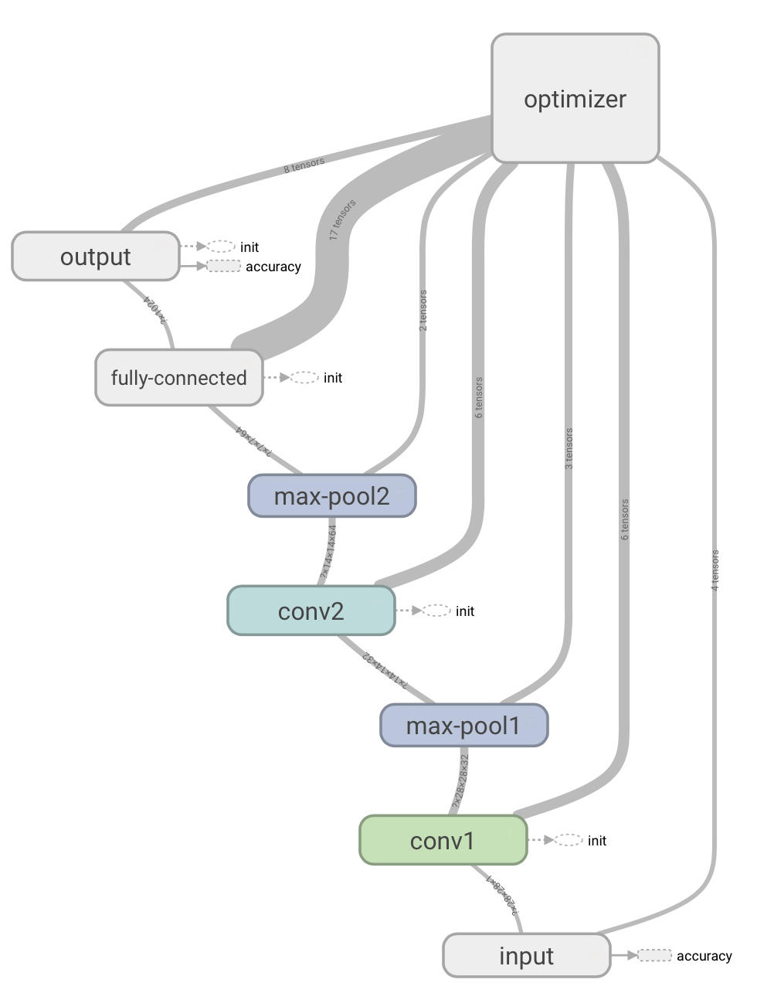

# CNN-MNIST Experiment

<p align="center">
  
</p>

In comparison to the [NN-MNIST](../nn-mnist/) and [RNN-MNIST](../rnn-mnist/) experiments, this experiment attempts to classify the [MNIST dataset](http://yann.lecun.com/exdb/mnist/) images using a (rather deep) Convolutional Neural Network instead.

The MNIST dataset consist of handwritten numbers from 0-9 saved in 28x28 images. Here's what a sample of what the numbers in MNIST look like:

<p align="center">
  
</p>

## Get Started
To get started, use the terminal to navigate to ```ml-in-tf/experiments/cnn-mnist/```and run ```python cnn-mnist.py```.

To see the graph and plots using ```tensorboard```, use the terminal to navigate to ```ml-in-tf/``` and run ```tensorboard --logdir logs/```. Wait for the following message:

```
Starting TensorBoard on port <port>
```
And then open up a browser and go to ```localhost:<port>```.

## Network
The network in this experiment has pretty much going on. It takes the inputs as 28x28 matrices and performs a series of convolutions and pooling operations, before passing it on to a fully-connected layer and then finally to an output as seen below.

| Input |Convolution| Max pool |Convolution | Max pool |Fully connected| Output |
|:-----:|:---------:|:--------:|:----------:|:--------:|:-------------:|:------:|
| 28x28 |  32 x 5x5 |    2x2	 |   64 x 5x5 |    2x2    |     1024     | 10     |

## Parameters
The customizable parameters of this experiment - and their default values - are as follows:

* ```minibatches``` -  ```20000``` -Number of minibatches to run the training on.
* ```minibatch_size``` - ```50``` - Number of samples in each minibatch.
* ```status_update``` -  ```100``` - How often to print an status update.
* ```random_seed``` - ```123``` -  Number of minibatches to run the training on.
* ```learning_rate``` - ```0.0001``` - Learning rate of the optimizer.
* ```optimizer``` -  ```adam``` -  If another optimizer should be used [adam, rmsprop, gradient_descent]. Defaults to ```gradient_descent```.
* ```run_test``` - ```True``` - If the final model should be tested.
* ```use_gpu``` -  ```False``` - If TensorFlow operations should run on GPU rather than CPU.