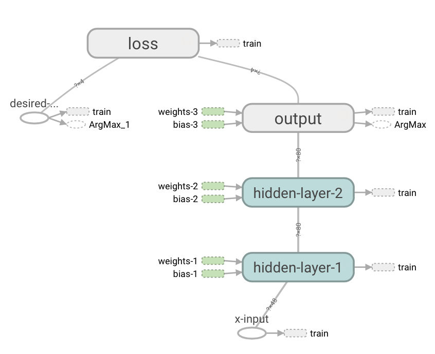

# NN-Gridworld Experiment

In comparison to the previous [Q-Gridworld](../q-gridworld) experiment, this experiment attempts to solve [Gridworld](../games/gridworld.py) using a Neural Network to estimate the Q-values instead of storing them in a table.

## Graph

  

