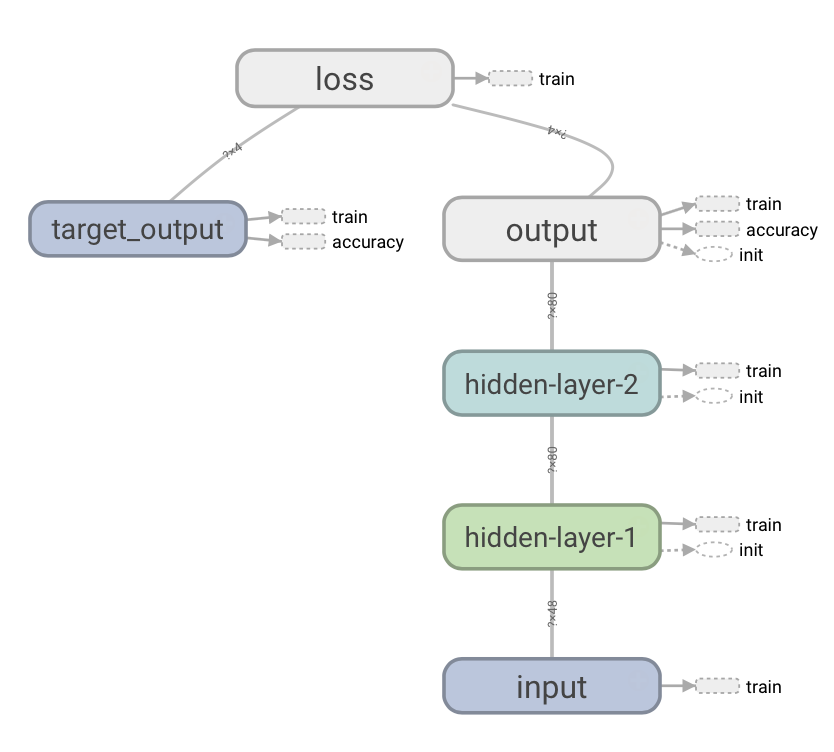
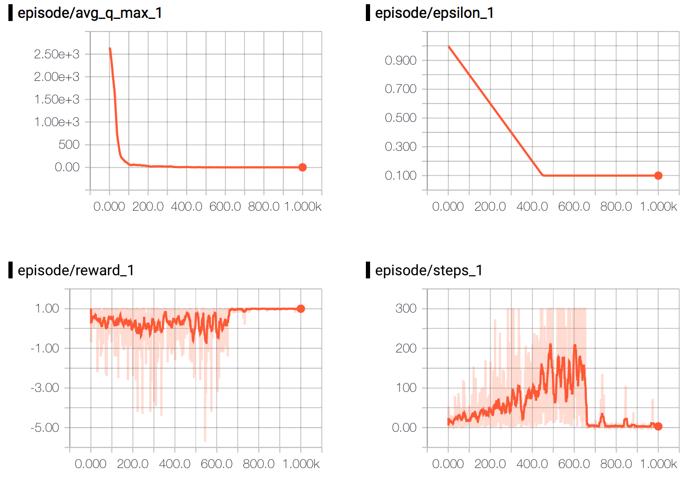
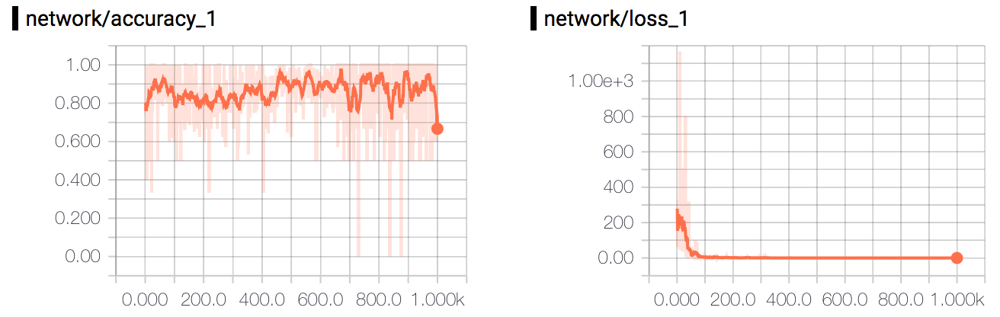

# NN-Gridworld Experiment
<p align="center">
  
</p>

In comparison to the [Q-Gridworld](../q-gridworld) experiment, we're now going train an agent to play [Gridworld](../games/gridworld.py) by utilizing a **Neural Network** (NN) instead of storing all Q-values in a table. By sending the state of the game as an input, the network will be trained to estimate the Q-values of that state.

The state of the game is defined as three zero-filled matricies of the field (```3 x [field_size, field_size]```) where the coordinate of the actor, pit and the goal is marked by setting that element of the matrix to 1.

At each step, the flattened state ```s``` (defined as a single row of size ```3 * field_size * field_size```) is fed into the Neural Network. The network then outputs a row of Q-values, each representing the values of the actions in the state ```s```. The  agent then performs an action according to its policy  ```π(s) = max(Q(s,a))``` or another random action given the exploration rate ```ε```.

Once the agent has taken its action, the Q-values of the next state ```s'``` are estimated, and the ```max(Q(s',a'))``` is then used to update the previous Q-value ```Q(s,a)``` as stated in [Q-Gridworld](../q-gridworld).

## Get Started
To get started, use the terminal to navigate to ```ml-in-tf/experiments/nn-gridworld/```and run ```python nn-gridworld.py```.

To see the graph and plots using ```tensorboard```, use the terminal to navigate to ```ml-in-tf/``` and run ```tensorboard --logdir logs/```. Wait for the following message:

```
Starting TensorBoard on port <port>
```
And then open up a browser and go to ```localhost:<port>```.

## Network 

The network in this experiment has two fixed hidden layers, but with customizable number of neurons in each hidden layers.
Given the variables ```input_size``` and ```action_size```, the network structure can be described as:

* ```input_size = 3 * field_size * field_size```
* ```action_size = 4 (up, down, left, right)```


| Input          | Hidden L1| Hidden L2  | Output          |
|:--------------:|:--------:|:----------:|:---------------:|
|```input_size```| 80 [c]   | 80 [c]     |```action_size```|

[c] - Customizable

## Parameters
The customizable parameters of this experiment - and their default values - are as follows:
#### Q Learning settings
* ```episodes ``` - ```100``` -  Number of minibatches to run the training on. 
* ```gamma``` -  ```0.99```- Discount (ɣ) to use when Q-value is updated. 
* ```initial_epsilon``` - ```1.0``` - Initial epsilon value that epsilon will be annealed from. 
* ```final_epsilon``` - ```0.1``` - Final epsilon value that epsilon will be annealed to. 

#### Network settings
* ```hidden_l1``` -  ```80``` -  Number of neurons in hidden layer 1.
* ```hidden_l2``` - ```80``` - Number of neurons in hidden layer 2.

#### Training settings
* ```learning_rate``` - ```0.001``` - Learning rate of the optimizer.
* ```optimizer``` -  ```rmsprop``` -  If another optimizer should be used [adam, gradientdescent, rmsprop]. Defaults to gradient descent.
* ```train_step_limit``` - ```300``` -  Limits the number of steps in training to avoid badly performing agents running forever.

#### General settings
* ```field_size``` -  ```4``` - Determines width and height of the Gridworld field.
* ```status_update``` -  ```10``` - How often to print an status update.
* ```use_gpu``` -  ```False``` - If TensorFlow operations should run on GPU rather than CPU.
* ```random_seed``` - ```123``` -  Number of minibatches to run the training on.

#### Testing settings
* ```run_test``` - ```True``` - If the final model should be tested.
* ```test_runs``` - ```100``` - Number of times to run the test.
* ```test_epsilon``` - ```0.1``` - Epsilon to use on test run.
* ```test_step_limit``` - ```1000``` -  Limits the number of steps in test to avoid badly performing agents running forever.


## Experiment results

<p align="center">
  
  
</p>

The plots above show the agents training progress running with all parameters set to their default values.

As you can see in the plot, something happend to the performance of the agent just after 600 episodes. From that point and beyond, it really got the gist of it and performed really well thereafter. The result of running 100 test runs with the fully trained agent can be seen in the table below.

|            | Average  |Max  | Min |
|:-----------|:--------:|:---:|:---:|
| **Steps**  | 2.66	    | 9   | 1   |
| **Rewards**| 0.48     | 1   | 0.1 |

## Next step
If you have played around anythin with the ```field_size```, you'll quickly notice that the network runs into trouble as you are approaching 10. This is partly due to the exponentially larger state we send in to the network, but also because a single row of states actually isn't the best possible representation of the game. 


