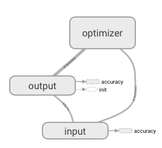
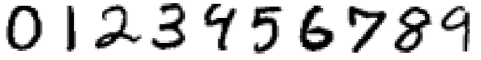
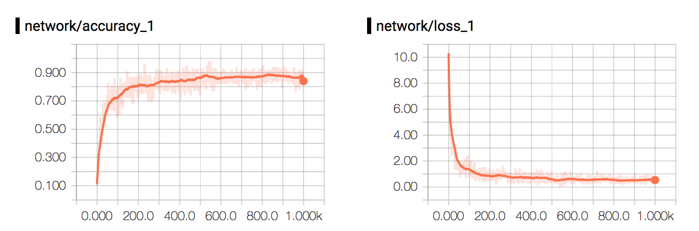

# NN-MNIST Experiment

<p align="center">
  
</p>

This experiment takes a very simple and straight forward approach of training a Neural Network to classify the [MNIST dataset](http://yann.lecun.com/exdb/mnist/), consisting of handwritten numbers from 0-9 saved in 28x28 images. Here's what a sample of what the numbers in MNIST look like:
<p align="center">
  
</p>

## Get Started
To get started, use the terminal to navigate to ```ml-in-tf/experiments/nn-mnist/```and run ```python nn-mnist.py```.

To see the graph and plots using ```tensorboard```, use the terminal to navigate to ```ml-in-tf/``` and run ```tensorboard --logdir logs/```. Wait for the following message:

```
Starting TensorBoard on port <port>
```
And then open up a browser and go to ```localhost:<port>```.


## Network
The network in this experiment has one fully connected layer. It takes every single image pixel as input represented as a one-dimensional of size 784 (=28x28) and outputs a softmax layer of size 10, one for each number-class.

| Input | Output  |
|:-----:|:-------:|
|784    | 10      | 

## Parameters
The customizable parameters of this experiment - and their default values - are as follows:

* ```minibatches``` -  ```1000``` -Number of minibatches to run the training on.
* ```minibatch_size``` - ```100``` - Number of samples in each minibatch.
* ```status_update``` -  ```100``` - How often to print an status update.
* ```random_seed``` - ```123``` -  Number of minibatches to run the training on.
* ```learning_rate``` - ```0.05``` - Learning rate of the optimizer.
* ```optimizer``` -  ```gradient_descent``` -  If another optimizer should be used [adam, rmsprop, gradient_descent]. Defaults to ```gradient_descent```.
* ```run_test``` - ```True``` - If the final model should be tested.
* ```use_gpu``` -  ```False``` - If TensorFlow operations should run on GPU rather than CPU.

## Experiment Results
The implementation is really straight forward and should receive an accuracy of ≈ 88% on the test set.
The plot below shows a standard run will all default parameters.
<p align="center">
  
</p>
