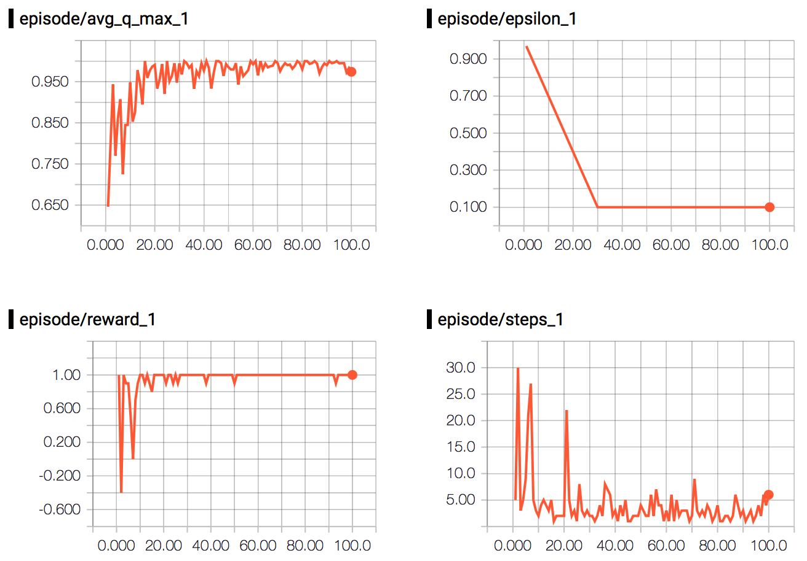

# Q-Gridworld Experiment

The purpose of this experiment is to show how a basic implementation of [Gridworld](../games/gridworld.py) could be solved with Q-Learning by storing and using all Q-values, _Q(s,a)_, in a table.

With the available actions (```up, down, right, left```), the table of Q-value has the shape:

```
[[a_0,    a_1,    a_2,    a_3],      # s_0
 [a_0,    a_1,    a_2,    a_3],      # s_1
 [a_0,    a_1,    a_2,    a_3],      # s_2
             ...                      ...
 [a_0,    a_1,    a_2,    a_3]]      # s_n
```

Every time the agent performs an action and transitions from one state to another, the Q-value for the previous state and action taken will be updated using two different update functions depending on if it is a nonterminal (1) or a terminal (2) state.

1. ``` Q(s,a) ⟵ Q(s,a) + η(r + ɣmax(Q(s',a') - Q(s,a)) ```. 
2. ``` Q(s,a) ⟵ r```

### Reward Function
The agent can receive three different rewards.

* ```+1``` for reaching the goal.
* ```-1``` for reaching the pit.
* ```-0.1``` for walking against the edges of the field (thus performing an action that doesn't move the agent).

### Terminal states
There are two different terminal states available.

* Reaching the goal.
* Reaching the pit.


## Performance
<p align="center">
  
</p>

The plots above show the agents training progress running with all parameters set to their default values.
As you can see in the plot, it only took the agent around 15-20 episodes before it had learned to play well. The result of running 100 test runs with the fully trained agent can be seen in the table below.

|            | Average  |Max  | Min |
|:-----------|:--------:|:---:|:---:|
| **Steps**  | 2.84	    | 10  | 1   |
| **Rewards**| 0.42     | 1   | 0.1 |

## Next step
You'll notice when you play around with the parameters (more specifically the field size) that it will take longer and longer for the agent to perform be able to perform well. In these cases, it might be smart to move away from having to keep all the states and Q-values in the memory and approach this problem from a different angle. 

How about using a Neural Network? Let's [give it a try](../nn-gridworld)!
