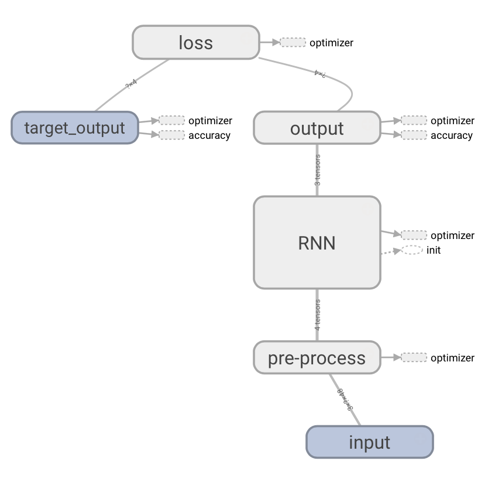
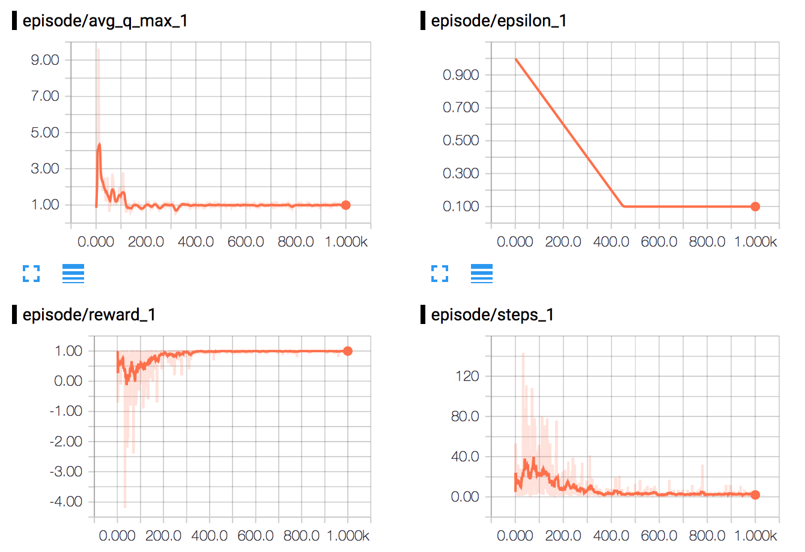
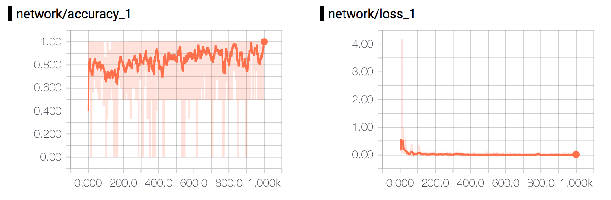
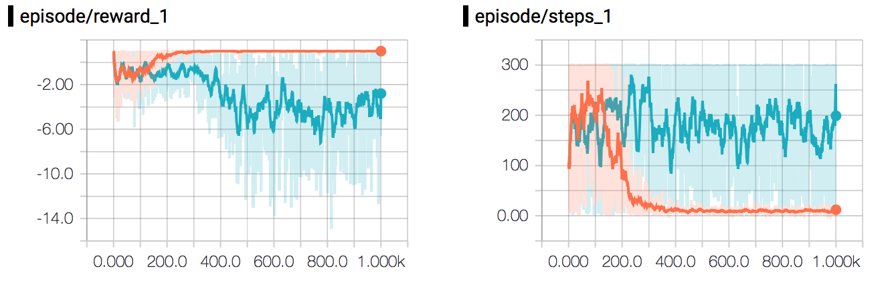
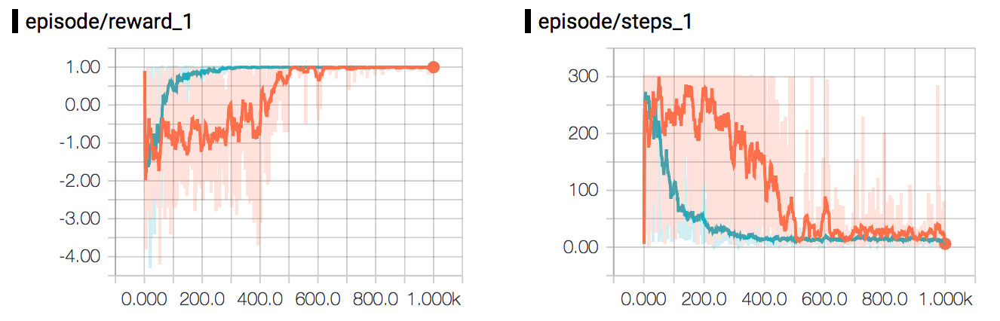

# RNN-Gridworld Experiment

**Note**: There seems to be an issue with this code running on TensorFlow 1.0. Working on getting it fixed as soon as possible!

<p align="center">
  
</p>

We managed to improve the performance of [Q-Gridworld](../q-gridworld) by extending it using a [Neural Network](../nn-gridworld) to estimate the Q-values instead of storing them in a table. What is the step if we want to further improve its performance?

We're going to have a look how we can solve it by using **Recurrent Neural Network** (RNN), which is similar to a regular Neural Netowrk in many ways, but has the ability to learn sequences rather than a single rows of input vectors, extending its observations in _time_.

## Get Started
To get started, use the terminal to navigate to ```ml-in-tf/experiments/rnn-gridworld/```and run ```python rnn-gridworld.py```.

To see the graph and plots using ```tensorboard```, use the terminal to navigate to ```ml-in-tf/``` and run ```tensorboard --logdir logs/```. Wait for the following message:

```
Starting TensorBoard on port <port>
```
And then open up a browser and go to ```localhost:<port>```.

## Parameters
The customizable parameters of this experiment - and their default values - are as follows:
#### Q Learning settings
* ```episodes ``` - ```100``` -  Number of minibatches to run the training on. 
* ```gamma``` -  ```0.99```- Discount (ɣ) to use when Q-value is updated. 
* ```initial_epsilon``` - ```1.0``` - Initial epsilon value that epsilon will be annealed from. 
* ```final_epsilon``` - ```0.1``` - Final epsilon value that epsilon will be annealed to. 

#### Network settings
* ```hidden``` -  ```80``` -  Number of hidden neurons in each RNN layer.s
* ```rnn_layers``` - ```2``` - Number of RNN layers.
* ```sequence_length``` - ```3``` - Unfolded RNN sequence length.

#### Training settings
* ```learning_rate``` - ```0.001``` - Learning rate of the optimizer.
* ```optimizer``` -  ```rmsprop``` -  If another optimizer should be used [adam, gradientdescent, rmsprop]. Defaults to gradient descent.
* ```train_step_limit``` - ```300``` -  Limits the number of steps in training to avoid badly performing agents running forever.

#### General settings
* ```field_size``` -  ```4``` - Determines width and height of the Gridworld field.
* ```status_update``` -  ```10``` - How often to print an status update.
* ```use_gpu``` -  ```False``` - If TensorFlow operations should run on GPU rather than CPU.
* ```random_seed``` - ```123``` -  Number of minibatches to run the training on.

#### Testing settings
* ```run_test``` - ```True``` - If the final model should be tested.
* ```test_runs``` - ```100``` - Number of times to run the test.
* ```test_epsilon``` - ```0.1``` - Epsilon to use on test run.
* ```test_step_limit``` - ```1000``` -  Limits the number of steps in test to avoid badly performing agents running forever.


## Network 
The network in this experiment has a customizable number of hidden layers and customizable numbers of LSTM-cells in each hidden layer.

```
input_size = 3 * field_size * field_size
action_size = 4 (up, down, left, right)
```


| Input          | Hidden Layers| Cells/Layer | Sequence length | Output          |
|:--------------:|:------------:|:-----------:|:---------------:|:---------------:|
|```input_size```| 2 [C]        |80 [C]       |  3 [C]          |```action_size```|

[C] - Customizable

## Performance

<p align="center">
  
  
</p>

The plots above show the agents training progress running with all parameters set to their default values.

As you can see in the plot, something happend to the performance of the agent just after 600 episodes. From that point and beyond, it really got the gist of it and performed really well thereafter. The result of running 100 test runs with the fully trained agent can be seen in the table below.

### Comparing NN-Gridworld with RNN-Gridworld

So how does [NN-Gridworld](../nn-gridworld) and RNN-Gridworld stand against each other?
To test this, I had both networks run on a 10x10 grid (```field_size = 10```), meaning that the input vector to the network now was ```3 * 10 * 10 ⟶ [1, 300]```, which is really large. However, the RNN still managed to learn how to play, and fairly quickly so!
You can compare them in the plow below, where the training progress of the **RNN** (orange) and **NN** (turquoise) network (with default parameters except ```field_size```) are plotted together.


<p align="center">
  
</p>

The test performance of the RNN then shows the following results, which is still quiet good!

|            | Average  |Max  | Min |
|:-----------|:--------:|:---:|:---:|
| **Steps**  | 2.39	    | 7   | 1   |
| **Rewards**| 0.53     | 1   |0.13 |

### Comparing RNN-Gridworld with Q-Gridworld

Let's go even further! This time, we're comparing the performance between the RNN-Gridworld to  [Q-Gridworld](../q-gridworld). They both ran on a 15x15 grid (```field_size = 15```), where the RNN operated with an input vector of size ```3 * 15 * 15 ⟶ [1, 135]```. All parameters were set to default values except ```field_size``` of them both and ```episodes```of the Q-Gridworld, which was set to ```1000```.

As you can see in the plot, showing the training progress of the **RNN** (orange) and **Q** (turquoise), they both still manage to learn how to play. Actually, looking the test results scores (**Avg. steps** and **Avg. rewards**), it appears that the RNN-Gridworld marginally beats the Q-Gridworld.
<p align="center">
  
</p>

|            | **RNN**   |**Q**  |
|:-----------|:--------:|:-----:|
| **Steps**  | 14.98    | 14.85 |
| **Rewards**| 0.10     | 0.12   |

