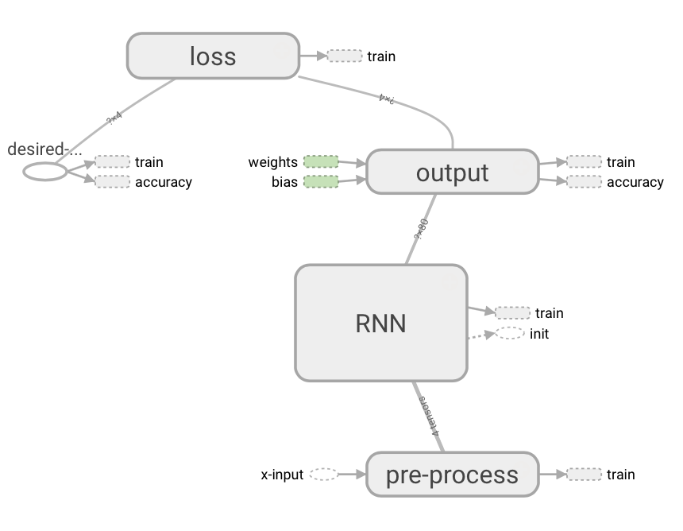

# RNN-Gridworld Experiment


## Network 
The network in this experiment has a customizable number of hidden layers and customizable numbers of LSTM-cells in each hidden layer.

```
input_size = 3*field_size*field_size
action_size = 4 (up, down, left, right)
```


| Input          | Hidden Layers| Cells/Layer | Timesteps | Output          |
|----------------|--------------|-------------|-----------|-----------------|
|```input_size```| 2 [C]        |80 [C]       |  3 [C]    |```action_size```|

[C] - Customizable

## Graph
<p align="center">
  
</p>