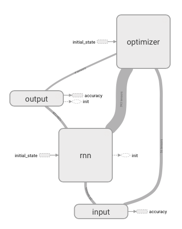
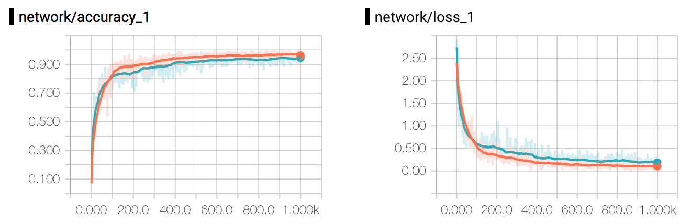

# RNN-MNIST Experiment

<p align="center">
  
</p>

In comparison to the [NN-MNIST](../nn-mnist/) experiment, this experiment attempts to classify the [MNIST dataset](http://yann.lecun.com/exdb/mnist/) images using a Recurrent Neural Network with LSTM cells instead.

The MNIST dataset consist of handwritten numbers from 0-9 saved in 28x28 images. Here's what a sample of what the numbers in MNIST look like:

<p align="center">
  
</p>

## Get Started
To get started, use the terminal to navigate to ```ml-in-tf/experiments/rnn-mnist/```and run ```python rnn-mnist.py```.

To see the graph and plots using ```tensorboard```, use the terminal to navigate to ```ml-in-tf/``` and run ```tensorboard --logdir logs/```. Wait for the following message:

```
Starting TensorBoard on port <port>
```
And then open up a browser and go to ```localhost:<port>```.

## Network
The network in this experiment is a little bit different. Since RNNs learn through sequences of data, it takes a total of 28 sequeces 28 pixels through 128 LSTM cells.


| Input | States | Hidden | Output |
|:-----:|:------:|:------:|:------:|
| 28 [c]| 28 [c] | 128 [c]| 10     |
[c] - Customizable

## Parameters
The customizable parameters of this experiment - and their default values - are as follows:

#### Network
* ```sequence_length``` -  ```28``` -Length of each RNN sequence.
* ```input_size``` -  ```28``` -Size of each input.
* ```hidden_size``` -  ```128``` - Number of hidden LSTM cells.
* ```cell_type``` -  ```lstm``` - Type of cell to use in the RNN.


#### Optimizer
* ```learning_rate``` - ```0.05``` - Learning rate of the optimizer.
* ```optimizer``` -  ```adam``` -  If another optimizer should be used [adam, rmsprop, gradient_descent]. Defaults to ```gradient_descent```.

#### General
* ```minibatches``` -  ```1000``` -Number of minibatches to run the training on.
* ```minibatch_size``` - ```128``` - Number of samples in each minibatch.
* ```status_update``` -  ```100``` - How often to print an status update.
* ```random_seed``` - ```123``` -  Number of minibatches to run the training on.
to ```gradient_descent```.
* ```run_test``` - ```True``` - If the final model should be tested.
* ```use_gpu``` -  ```False``` - If TensorFlow operations should run on GPU rather than CPU.

## Experiment Results

While running this experiment, you can expect to receive an accuracy of around ≈94% using **RNN** as your ```cell_type```. However, going with the more robust **LSTM** cell should get you all the way to ≈97%.

The plot below shows two runs with all default parameters where orange one represents **LSTM** while the blue one represents **RNN**.
<p align="center">
  
</p>
