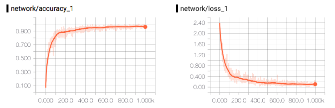

# RNN-MNIST Experiment

## Get Started
To get started, use the terminal to navigate to ```ml-in-tf/experiments/rnn-mnist/```and run ```python rnn-mnist.py```.

To see the graph and plots using ```tensorboard```, use the terminal to navigate to ```ml-in-tf/``` and run ```tensorboard --logdir logs/```. Wait for the following message:

```
Starting TensorBoard on port <port>
```
And then open up a browser and go to ```localhost:<port>```.


## Graph
<p align="center">
  
</p>

## Plot
<p align="center">
  
</p>