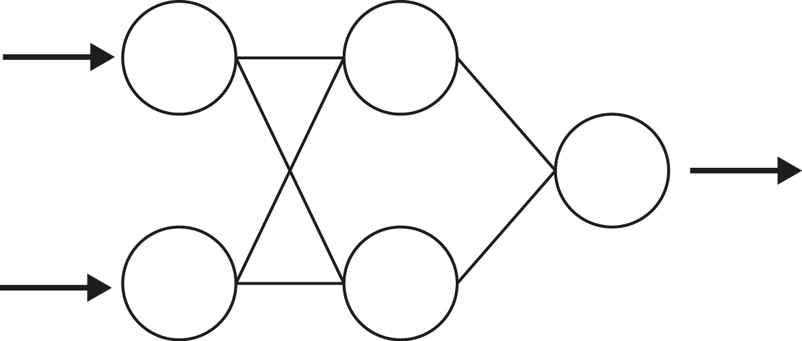
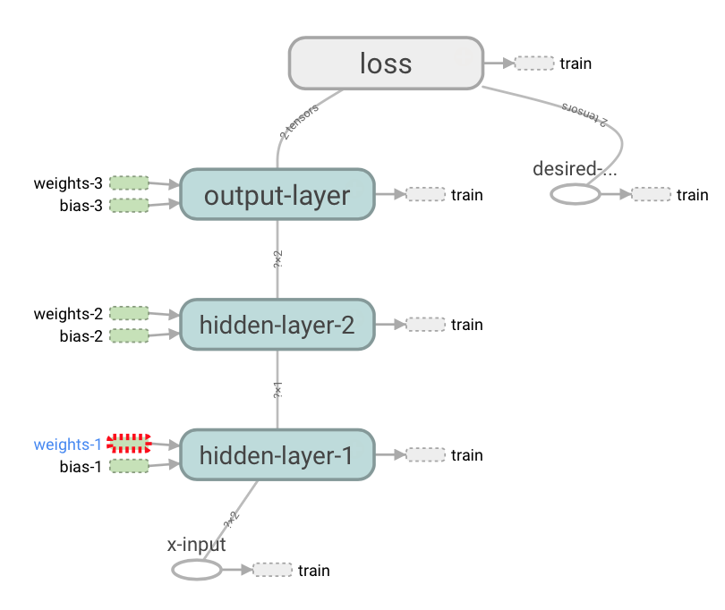
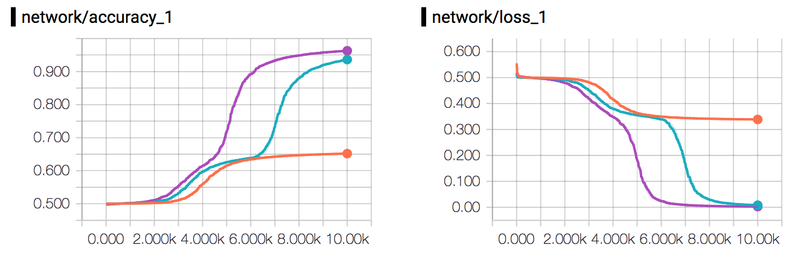

# XOR Experiment

## Network
Image of the network

  

## Graph

  

## Plot

  

Example graph showing the error over batches/epochs with <b style='color:orange'>one hidden node</b>, <b style='color:LightSeaGreen'>two hidden nodes</b> and <b style='color:purple'>three hidden nodes</b>.

|    		| Input   | Hidden layer 1 |Hidden layer 2| Output |
|---------|---------|------------------------------|--------------|--------------|
|**Neurons**|   1 		| 2<a name="myfootnote1">* </a> |2<a name="myfootnote1">* </a>  | 1 |
|**Variables**|   2 		| 2<a name="myfootnote1">* </a> x Nodes |2<a name="myfootnote1">* </a> x Nodes  | 1 |

[1](#myfootnote1) Customizable